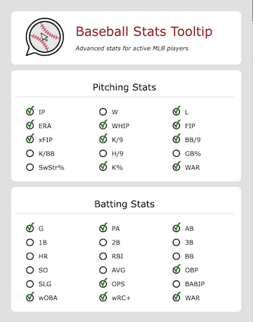
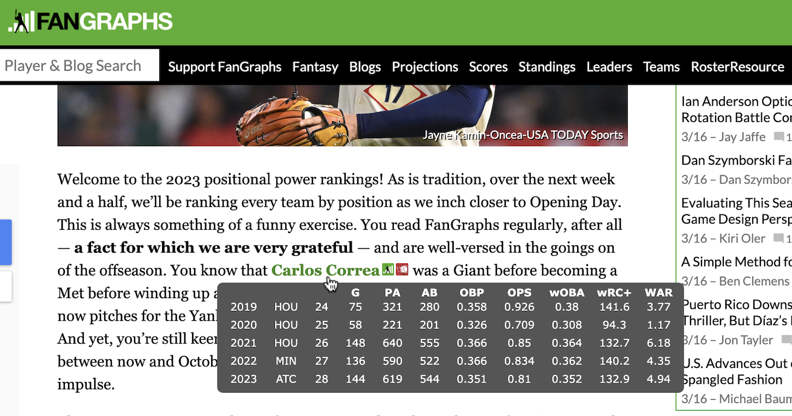
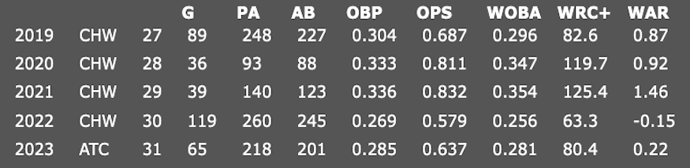

# Stats Tooltip
Extension to dynamically insert hover-on tooltips for MLB active players. Provides customizeable statistics on active MLB players for the past three seasons, as well as aggregate projections. Also provides a link to Fangraphs and Baseball Reference proiles.

Select the stats you want to display for both pitchers and position players.

Samples below from Fangraphs, the Athletic, and MLBtradeRumors. This tooltip should work on most articles referencing currently active MLB players.

Stats are pulled from Fangraph. Player ID mapping provided by: https://www.smartfantasybaseball.com
