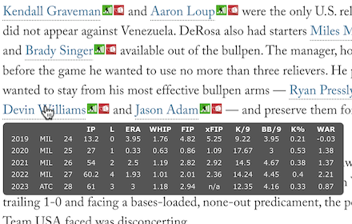

# Stats Tooltip
Extension to dynamically insert hover-on tooltips for MLB active players. Provides customizeable statistics on active MLB players for the past three seasons, as well as aggregate projections (ATC). All data is live and will update as the season progresses. Also provides a link to Fangraphs and Baseball Reference profiles.

Select the stats you want to display for both pitchers and position players.

Samples below from Fangraphs, the Athletic, and MLBtradeRumors. This tooltip should work on most articles referencing currently active MLB players. I've tested it on about 45 websites listed in manifest.json.

## How does it work?
Stats tooltip pulls a list of likely player names based on a regex pattern that resembles names. Then it compares against a JSON player mapping, which stores Fangraphs and Baseball Reference player ids. It uses that data to make an API request to Fangraphs, and create links to both sites. All data is formatted then inserted into the the page.

Player data is stored in chrome.storage.local to prevent redundant API calls. All cached data is timestamped and updated every 24hrs. Ive set an arbitrary limit on the amount of data cached.

Stats are pulled from Fangraphs. Player ID mapping provided by: https://www.smartfantasybaseball.com
